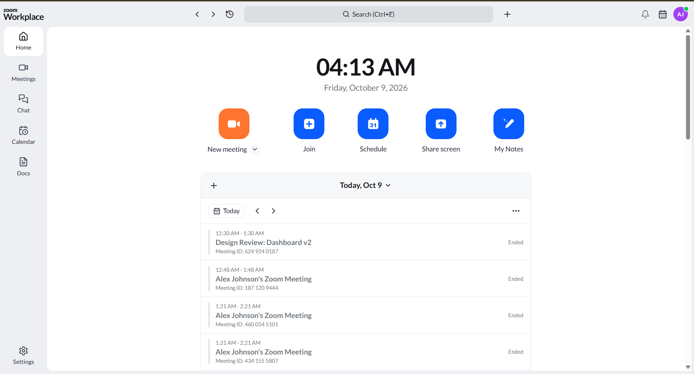
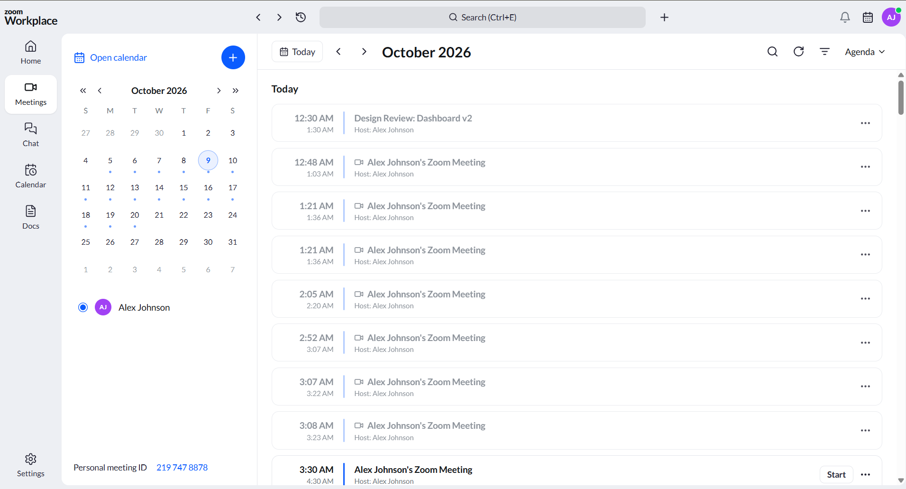
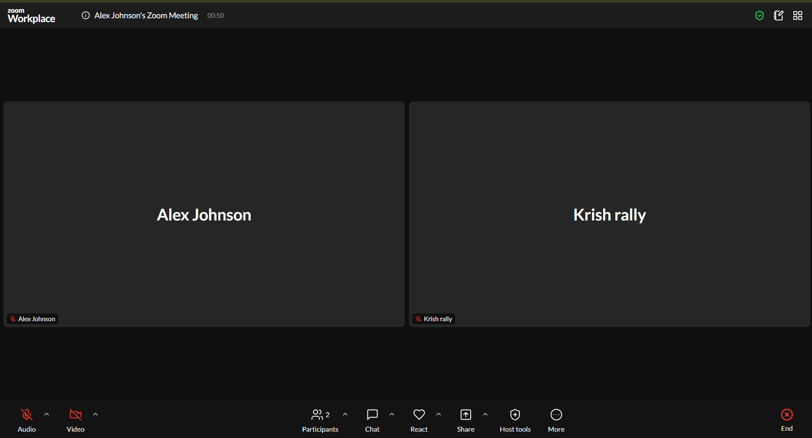
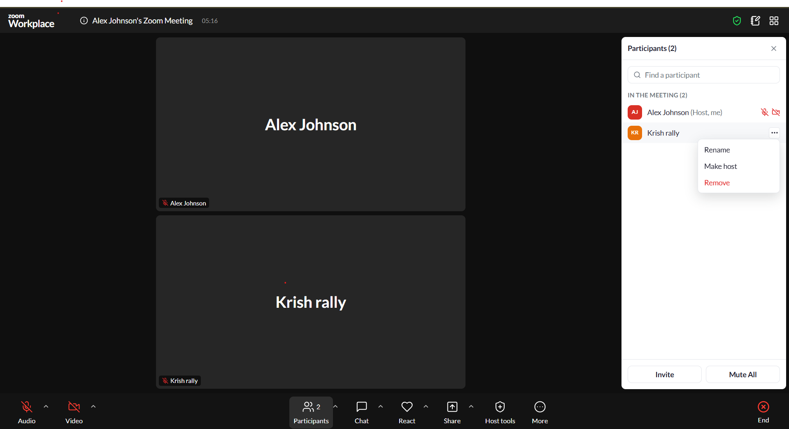
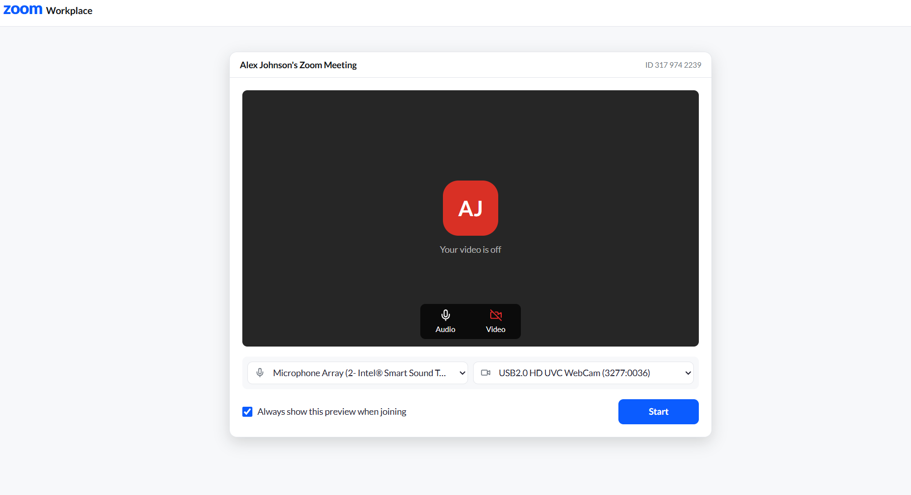
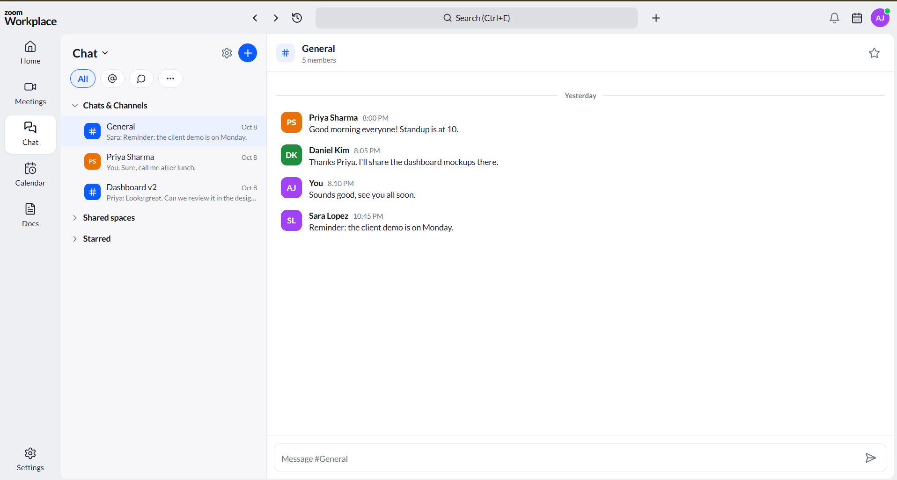
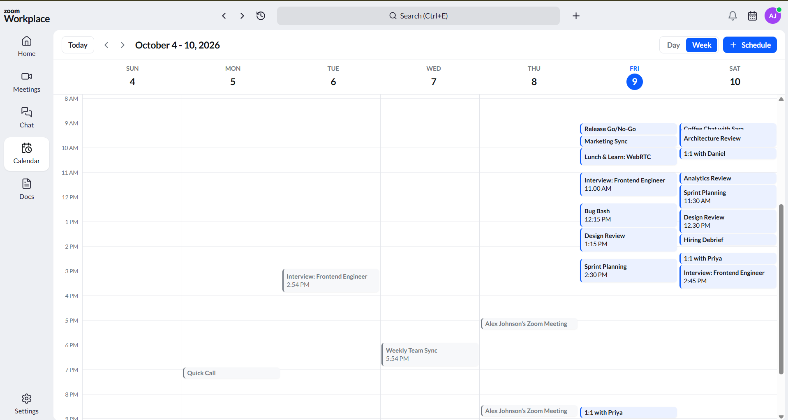
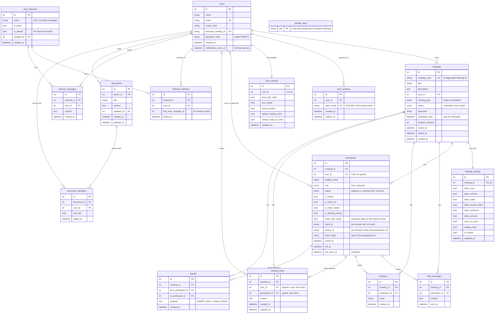

# Zoom Clone

A video meeting web app that looks and works like **Zoom Workplace**. Start a meeting in one click, invite people with a link, schedule meetings, and run the room with real audio, video, screen sharing, chat and host controls.

**Built with** Next.js 14 · TypeScript · Tailwind CSS · Python FastAPI · SQLite (SQLAlchemy) · WebRTC

| | |
|---|---|
| **Live app** | https://scaleraizoomclone-frontend.vercel.app |
| **API docs** (Swagger) | https://scaleraizoomclone-production.up.railway.app/docs |
| **Sign in** | Not needed. The app opens signed in as the demo user **Alex Johnson** (`alex.johnson@example.com` / `zoomdemo123`), who already has meetings. You can also sign up with your own email. |

<!-- 📸 SCREENSHOT 1 (hero): the Home page on desktop. Save it as docs/screenshots/home.png -->


---

## Contents

1. [Try it in 2 minutes](#try-it-in-2-minutes)
2. [Screenshots](#screenshots)
3. [Features](#features)
4. [Assignment checklist](#assignment-checklist)
5. [Tech stack](#tech-stack)
6. [How it works](#how-it-works)
7. [Database design](#database-design)
8. [Code structure](#code-structure)
9. [Run it locally](#run-it-locally)
10. [Tests](#tests)
11. [Deployment](#deployment)
12. [Assumptions and limits](#assumptions-and-limits)
13. [What I would add next](#what-i-would-add-next)
14. [API reference](#api-reference)

---

## Try it in 2 minutes

A short tour of the main features. Everything happens on the live app.

1. **Open the app.** You land on the Home page, already signed in as Alex. The "Today" card and the Meetings tab are full of sample meetings.
2. **Start a meeting.** Click **New meeting**. A preview window shows your camera and lets you pick your microphone and camera. Click **Start**.
3. **Invite a second person.** In the meeting, click **ⓘ** next to the title and copy the invite link. Open it in a **private / incognito window** (or on another device), type a name and click **Join**. You now have two people in the meeting.
4. **Talk and share.** Both windows see and hear each other. Try **Chat**, **React**, **Raise Hand** and **Share** (pick Screen, Window or Browser tab, then "Screen only" or "Screen and my video").
5. **Be the host.** In the first window open **Participants** and hover over the guest: **Mute** them, or **...** then **Remove** (they can't rejoin). Open **Host tools** to turn on the **waiting room**, **lock** the meeting, or block chat, video or screen sharing. Then join again from another private window and **Admit** the person from the waiting room.
6. **Schedule a meeting.** Back on Home, click **Schedule**, pick a date, time and duration, and save. It shows up in **Upcoming meetings**, on the **Meetings** page and on the **Calendar**.
7. **Share your screen from Home.** Click **Share screen**, enter a Meeting ID (and the passcode if asked), choose what to share, and you join that meeting already sharing.

> **Good to know:** audio and video between people work when everyone is on the **same Wi-Fi network** (see [Assumptions and limits](#assumptions-and-limits)). Everything else works from anywhere.

---

## Screenshots

<!--
📸 Add your screenshots to docs/screenshots/ with exactly these file names.
Each image below will appear automatically once its file is there.
-->

| | |
|---|---|
|  <br> **Meetings:** month calendar and day by day agenda |  <br> **Meeting room:** two people, Zoom style toolbar |
|  <br> **Share screen:** what to share, then how to present |  <br> **Host controls:** participants panel and Host tools |
|  <br> **Preview window** before joining |  <br> **Team Chat** |
|  <br> **Calendar** week view |  <br> **On a phone** |

---

## Features

### Core (from the assignment)
- **Dashboard** laid out like the Zoom Workplace app: top bar (search, notifications, profile), side bar (Home, Meetings, Chat, Calendar, Docs, Settings), a big clock, the action buttons (New meeting, Join, Schedule, Share screen, My Notes), a **Today** card with day by day navigation, and **Upcoming** and **Recent** meetings.
- **Instant meeting:** one click creates a meeting with a unique 10 digit Meeting ID, a passcode and an invite link, then takes you into the room as host.
- **Join meeting:** by Meeting ID (spaces are fine) or by pasting the invite link. The server checks the meeting exists first. You enter your name (and the passcode, filled in from invite links) in a Zoom style **preview window**.
- **Schedule meeting:** topic, description, date and time pickers, duration, optional passcode, waiting room and mute on entry. The invite link is created automatically, saved, and shown in Upcoming.

### Meeting room
- **Real audio, video and screen sharing** between people (WebRTC), with a green border on whoever is talking and a Speaker view that follows them.
- **Share Screen like Zoom:** choose Screen, Window or Browser tab, with "Share sound" and "Optimize for video clip", then a presentation option ("Screen only" or "Screen and my video"). One person shares at a time.
- **Chat**, **reactions** everyone sees, **raise hand**, private **notes** that save as you type, gallery and speaker **views**, and switching microphone or camera mid meeting.
- **Participants panel** with search, mic and camera status, and rename.

### Host controls
- **Mute all**, mute one person, **remove** someone (they can't rejoin), **rename**, **make host**, **end meeting for all**.
- **Waiting room** with Admit, Admit all and Remove. **Lock** the meeting.
- **Allow participants to** chat, unmute, start video, share screen, react and rename. Blocked buttons grey out, and **the server enforces every rule**, so they can't be bypassed.
- **Suspend participant activities:** one click mutes everyone, stops video, turns everything off and locks the meeting.
- A host who leaves is asked to hand over to someone first.

### Beyond the brief
- **Accounts:** sign up with any email, sign in, sign out, change password. Passwords are hashed and sessions can be revoked.
- **Settings:** profile, password, meeting defaults, and a microphone and camera test.
- **Meetings page** with a month calendar and an agenda, **Calendar** week view (click an empty slot to schedule), **Team Chat** (channels and direct messages), **Docs** (templates, autosave, sharing as editor or viewer), **notifications** and **search**.
- **Works on phones, tablets and desktops.**

---

## Assignment checklist

| Requirement | Status | Where to find it |
|---|---|---|
| **Landing dashboard:** Zoom style UI, navbar with profile and settings, New / Join / Schedule buttons, Upcoming and Recent meetings | ✅ | Home page (`frontend/app/page.tsx`, `components/home/`, `components/layout/AppShell.tsx`) |
| **Instant meeting:** create instantly, unique Meeting ID, invite link, go to the room | ✅ | New meeting button, `POST /api/meetings/instant`, `services/meetings.py`, `services/codes.py` |
| **Join meeting:** by ID or link, enter a name first, check the meeting exists | ✅ | Join dialog and preview window (`components/modals/JoinMeetingModal.tsx`, `app/j/[code]/page.tsx`), `GET /api/meetings/lookup` |
| **Schedule meetings:** title, description, date and time, duration, auto link, saved, shown in Upcoming | ✅ | `components/modals/ScheduleMeetingModal.tsx`, `POST /api/meetings/scheduled` |
| **Bonus: responsive design** | ✅ | Tested at phone, tablet and desktop widths; phones get bottom tabs and a compact toolbar |
| **Bonus: login and signup** | ✅ | `/signin`, `/signup`, `services/auth.py`, `services/security.py` |
| **Bonus: host controls (mute all, remove)** | ✅ plus more | Participants panel and Host tools, `services/host_controls.py` |
| **No login required** | ✅ | A default user is signed in automatically (`components/providers/RequireAuth.tsx`) |
| **Sample data** | ✅ | `backend/app/seed.py`: users, past meetings, chats, docs, and 5 to 10 meetings every day |
| **Own database schema** | ✅ | [Database design](#database-design) |
| **README with setup, tech stack, assumptions** | ✅ | This file |

---

## Tech stack

| Part | Choice | Why |
|---|---|---|
| Frontend | **Next.js 14** (App Router), **TypeScript**, **Tailwind CSS** | A single page app with fast navigation; Tailwind makes it quick to match Zoom's look |
| Icons | lucide-react | Clean line icons close to Zoom's |
| Backend | **Python, FastAPI** | Simple, fast, typed, and it generates interactive API docs |
| Database | **SQLite** with **SQLAlchemy 2.0** | SQLite as the brief asks; the ORM keeps queries readable and safe |
| Validation | Pydantic | Every request and response has a checked shape |
| Real-time media | **WebRTC** (browser built-in) | Audio, video and screen go straight between browsers; the server only helps them connect |
| Tests | pytest + FastAPI TestClient | 56 tests covering the API and its rules |
| Hosting | **Vercel** (frontend), **Railway** (backend, with a disk for SQLite) | Vercel is made for Next.js; Railway keeps the database file between restarts |

---

## How it works

```
 Browser (Next.js, on Vercel)
   │  pages, components, hooks
   │
   │  HTTPS + JSON  (lib/api.ts is the only place that calls the backend)
   ▼
 FastAPI (on Railway)
   routers/   → only HTTP: read the request, call a service, return JSON
   services/  → all the rules: who can join, passcodes, host checks, when a meeting ends
   models.py  → SQLAlchemy tables
   ▼
 SQLite file (on a persistent disk)

 Audio / video / screen:  Browser A ◄──── WebRTC, direct ────► Browser B
                          (the server only passes the "offer" and "answer" notes)
```

**The meeting room stays in sync by polling.** Every 2 seconds the room asks the server for the meeting, the people in it, new chat messages and its own status, all in one call (`GET /api/meetings/{code}/state`). The same call is a heartbeat: anyone who stops checking in for 30 seconds (closed tab, lost connection) is marked as left, and the meeting ends when the last person leaves. Polling is simple and works on any host; WebSockets would be the next step for scale.

**Video calls use WebRTC.** Each pair of people gets a direct browser-to-browser connection. To connect, the browsers swap two short notes through the API: an **offer** and an **answer**, which describe what each side sends and how to reach it. The person with the lower participant id always sends the offer, so two people never offer to each other at once. Each connection has four fixed slots (microphone, camera, screen, screen sound). Muting, turning the camera off and sharing just swap what is in a slot, so the connection never has to be set up again. Connections that get no answer or drop are restarted automatically. See `frontend/lib/webrtc.ts`.

**Security, in short**
- **Passwords** are hashed with salted PBKDF2-SHA256 (600,000 rounds). Wrong password and unknown email give the same message, so the form can't reveal who has an account.
- **Sessions** are random tokens; the database stores only their hash, so signing out or changing your password revokes them immediately.
- **Room actions need a participant key.** Participant ids are guessable numbers, so joining returns a secret key, and every room action (including host controls) must send it. Only its hash is stored.
- **The server decides who is host** from the sign in. Nothing the browser sends can claim host, and every host rule is checked again on the server.

**Other details**
- **No duplicate people:** rejoining from the same tab (after Back, a refresh or a crash) replaces your old entry instead of adding a second one.
- **Host mute sync:** when the host mutes you, your next poll sees it and your browser turns your microphone off, with a message.
- **Sample data keeps itself fresh:** the demo account always has 5 to 10 meetings a day for the next two weeks, so the dashboard never looks empty.

---

## Database design

16 tables. The meeting tables are the heart of it; accounts, Team Chat and Docs sit around them.



### Key design decisions

- **A public Meeting ID separate from the database id.** `id` is the internal key used in relationships; `meeting_code` is the 10 digit number people type. It is unique and indexed, and can follow its own format without touching the keys.
- **One `participants` row per join, with a status.** Leaving or being removed changes `status` instead of deleting the row. This keeps the history that powers "Recent meetings", meeting durations, chat authors, and keeping removed people out.
- **Guests are first-class.** `participants.user_id` is optional, so people can join with just a name, like Zoom. Chat messages, reactions and guest notes point to the participant, not the user, so they show the name used in that meeting.
- **Meeting rules live in `meeting_settings` (one row per meeting).** New meetings copy the owner's `user_settings` defaults; the host can then change them for that meeting only. The `meetings` table stays focused.
- **Secrets are never stored in plain form.** Passwords are salted hashes; session tokens and participant keys are stored only as SHA-256 hashes.
- **Short-lived tables stay small.** `signals` (WebRTC notes) are deleted once delivered or after 2 minutes, and `reactions` are only read for the last few seconds.
- **Unread counts without a read table.** `channel_members.last_read_message_id` plus ever-growing message ids means "unread" is one indexed count per conversation.
- **Notes have two optional owners.** Signed-in users' notes are keyed by `user_id` (same note if they rejoin); guests' notes by `participant_id`. Two unique indexes keep one note per person.
- **Notifications and the calendar need no extra tables.** They are built from existing data (unread chats, shared docs, upcoming meetings); one column, `users.notifications_seen_at`, tracks what is new.
- **Integrity is enforced by the database:** foreign keys are on with `ON DELETE CASCADE`, and unique indexes stop duplicates (for example one membership per person per channel or document).
- **Indexes match the real queries:** `meetings(host_id, status, scheduled_start)` for the dashboard, `participants(meeting_id, status)` for the live room and waiting room, `chat_messages(meeting_id, id)` for new messages, `signals(to_participant_id, id)` for each browser's inbox.
- **Times are stored in UTC** and sent with a time zone, so every browser shows local time.
- **Upgrading the live database:** new tables are created on startup, and new nullable columns are added by a small `add_missing_columns()` step, so the deployed SQLite file upgrades without losing data. A larger project would use Alembic migrations.

---

## Code structure

```
backend/
  app/
    main.py             app setup, CORS, error handling, startup (create tables, seed data)
    config.py           settings from environment variables
    database.py         engine, sessions, foreign keys on, small schema upgrade step
    models.py           SQLAlchemy tables
    schemas.py          Pydantic request and response shapes
    dependencies.py     who is signed in, and the participant key header
    seed.py             sample users, meetings, chats and docs
    routers/            HTTP only: auth, users, meetings, participants, team_chat, documents, notifications
    services/           the rules, one file per topic
      meetings.py         create, schedule, look up, list, end
      participants.py     join, waiting room, leave, check in, change yourself, live room state
      host_controls.py    mute, remove, admit, rename, make host, settings, suspend, end for all
      meeting_chat.py     in-meeting chat and reactions
      notes.py            private meeting notes
      signals.py          WebRTC offers and answers between browsers
      auth.py, security.py, team_chat.py, documents.py, notifications.py, codes.py, errors.py
  tests/                test_api.py (accounts, meetings, rooms), test_workspace.py (chat, docs, calendar)

frontend/
  app/                  pages: / (home), /meetings, /meeting/[code] (room), /j/[code] (preview),
                        /join, /calendar, /chat, /docs, /settings, /signin, /signup
  components/           ui/ (Modal, Avatar...), layout/, home/, meetings/, room/, share/, modals/,
                        chat/, calendar/, docs/, settings/, auth/, providers/
  hooks/                useMeetings, useStartMeeting, useMeetingRoom, useLocalMedia, usePeerMesh, ...
    room/               the meeting room's logic, one hook per job:
                        useScreenShare, useMeetingCall, useHostActions, useMediaSync, useRoomNotices
  lib/                  api.ts (every backend call), webrtc.ts (calls), shareScreen.ts, types.ts,
                        format.ts, session.ts, calendar.ts
```

**Principles**
- **Thin routers, rich services.** Routers only handle HTTP. All business rules live in `services/`, which raise plain Python errors that `main.py` turns into HTTP responses, so the rules are easy to read and test.
- **One place talks to the backend.** Every API call is in `frontend/lib/api.ts`, fully typed with `lib/types.ts`.
- **Pages compose, hooks hold logic.** For example, the meeting room page (`app/meeting/[code]/page.tsx`) only puts components together; screen sharing, the call, host actions and mic and camera syncing are each their own hook.
- **Reusable pieces:** the same share window is used on Home and in the room; `Modal`, `Avatar`, the app frame and the meeting cards are shared across pages.

---

## Run it locally

You need **Python 3.11+** and **Node 18+**.

**1. Backend** (http://localhost:8000, API docs at http://localhost:8000/docs)
```bash
cd backend
python -m venv .venv
source .venv/bin/activate          # Windows: .venv\Scripts\activate
pip install -r requirements-dev.txt
uvicorn app.main:app --reload --port 8000
```
The SQLite file `zoom.db` is created and filled with sample data on first start. Delete it to start fresh.

**2. Frontend** (http://localhost:3000)
```bash
cd frontend
npm install
cp .env.example .env.local         # NEXT_PUBLIC_API_URL=http://localhost:8000
npm run dev
```
Open http://localhost:3000. You are signed in as the demo user straight away. To try two people in one meeting, open the invite link in a private window.

---

## Tests

```bash
cd backend
pytest -q          # 56 tests
```

They cover accounts and sessions, creating, scheduling, joining and ending meetings, passcodes and locked meetings, the waiting room, every host control (including that guests can't use them and that removed people can't rejoin), host rules enforced on the server, chat, reactions, notes, screen sharing rules, WebRTC signalling, Team Chat, Docs sharing, notifications, search and the sample data.

The frontend is checked with TypeScript and ESLint (`npm run lint`), and the main flows (calls between two and three browsers, screen sharing, host controls, sign in, chat, calendar, docs, phone layouts) were tested end to end in real browsers with Playwright during development.

---

## Deployment

**Backend on Railway**
1. New Project, Deploy from GitHub repo, pick this repo.
2. In the service **Settings**, set **Root Directory** to `backend`. Railway reads `backend/railway.json` for the start command and health check.
3. Add a **Volume** mounted at `/data`.
4. Under **Variables**, add `DATABASE_URL` = `sqlite:////data/zoom.db`, and `FRONTEND_URL` and `CORS_ORIGINS` = your Vercel URL. Optional: `DEMO_PASSWORD`.
5. Under **Settings > Networking**, click **Generate Domain**, then check `https://<domain>/api/health` returns `{"status":"ok"}`.

**Frontend on Vercel**
1. Add New Project and import this repo.
2. Set **Root Directory** to `frontend` (Next.js is detected automatically).
3. Add `NEXT_PUBLIC_API_URL` = your Railway URL, without a trailing slash.
4. Deploy. If you change `NEXT_PUBLIC_API_URL` later, redeploy, because it is built into the app.

---

## Assumptions and limits

- **A default user is signed in**, as the brief asks. Everyone who uses the live app without signing up shares the demo account, so they see each other's meetings. People opening an **invite link** are not signed in: they join as guests with their own name, like Zoom.
- **Video calls are for people on the same Wi-Fi network.** On one network browsers can always reach each other directly. Across different networks (for example phone data), some routers block direct connections, which would need a TURN relay server; this project leaves that out on purpose. If someone can't be reached, the room says so, and chat, reactions and everything else keep working.
- **Calls are built for small meetings.** Each person sends their video to every other person (a "mesh"), which is fine for a handful of people. Large meetings would need a media server (an SFU such as LiveKit).
- **Polling, not WebSockets.** Updates arrive within about 2 seconds and calls take 1 to 3 seconds to connect. WebSockets would make this near instant.
- **Screen picking:** browsers don't let a website list your windows, so after choosing Screen, Window or Browser tab, the browser shows its own list to pick the exact one.
- **Browsers may block sound until you click.** If so, a "Click to hear the other participants" bar appears.
- **Accounts:** any email can sign up. Emails aren't verified and there is no "forgot password" yet (both need an email service). The sign-in token is kept in the browser's storage because the site and API are on different domains.
- **Removed people** are recognised by their account or, for guests, by their browser. A guest who switches to a different browser or device could still get back in.
- **Sample meetings** are placed in working hours in India time (configurable with `DEMO_UTC_OFFSET_MINUTES`). Times are shown in your browser's time zone.
- **No Zoom assets are used.** The Zoom wordmark is drawn as text and icons come from the open-source lucide set.

---

## What I would add next

- WebSockets for instant updates
- A TURN relay and an SFU media server, so calls work across any network and scale to large meetings
- Virtual backgrounds and background blur
- Email verification and "forgot password"
- Sign in with Google
- Recurring meetings and calendar invites (.ics)
- Database migrations with Alembic and end-to-end tests in CI

---

## API reference

Interactive docs: https://scaleraizoomclone-production.up.railway.app/docs

<details>
<summary><b>All 46 endpoints</b> (click to expand)</summary>

| Method | Path | What it does |
|---|---|---|
| GET | `/api/health` | Health check |
| POST | `/api/auth/signup` | Create an account, returns a session token |
| POST | `/api/auth/login` | Sign in, returns a session token |
| POST | `/api/auth/logout` | Sign out (ends the session) |
| GET / PATCH | `/api/users/me` | The signed-in user / change name or colour |
| POST | `/api/users/me/password` | Change password (signs out other devices) |
| GET / PATCH | `/api/users/me/settings` | Personal meeting defaults |
| GET | `/api/users/search?q=` | Find people by name or email |
| GET | `/api/meetings/upcoming` | Scheduled meetings that haven't finished |
| GET | `/api/meetings/recent` | Meetings that have started, newest first |
| GET | `/api/meetings/calendar?start=&end=` | Your meetings in a date range |
| GET | `/api/meetings/search?q=` | Your meetings by title or Meeting ID |
| POST | `/api/meetings/instant` | Create an instant meeting |
| POST | `/api/meetings/scheduled` | Schedule a meeting |
| GET | `/api/meetings/lookup?q=` | Check a Meeting ID or invite link exists |
| GET / PATCH / DELETE | `/api/meetings/{code}` | Host only: view, edit, delete |
| POST | `/api/meetings/{code}/join` | Join with a name (and passcode for guests) |
| GET | `/api/meetings/{code}/state` | Room polling and heartbeat |
| POST | `/api/meetings/{code}/messages` | Send a chat message |
| POST | `/api/meetings/{code}/reactions` | Send a reaction |
| GET / PUT | `/api/meetings/{code}/notes` | Read / save your private notes |
| GET | `/api/meetings/{code}/notes/mine` | Your notes, for the Meetings page |
| POST | `/api/meetings/{code}/mute-all` | Host: mute everyone else |
| POST | `/api/meetings/{code}/admit-all` | Host: let everyone in from the waiting room |
| PATCH | `/api/meetings/{code}/settings` | Host: change meeting rules |
| POST | `/api/meetings/{code}/suspend` | Host: suspend participant activities |
| POST | `/api/meetings/{code}/end` | Host: end for everyone |
| PATCH | `/api/participants/{id}` | Change your own mic, camera, hand, screen sharing or name |
| POST | `/api/participants/{id}/leave` | Leave the meeting |
| POST / GET | `/api/participants/{id}/signals` | WebRTC: send / collect offers and answers |
| POST | `/api/participants/{id}/mute` | Host: mute one person |
| POST | `/api/participants/{id}/remove` | Host: remove one person (they can't rejoin) |
| POST | `/api/participants/{id}/admit` | Host: let someone in from the waiting room |
| POST | `/api/participants/{id}/rename` | Host: rename someone |
| POST | `/api/participants/{id}/make-host` | Host: hand over the host role |
| GET / POST | `/api/chat/channels` | Your conversations / create a channel |
| POST | `/api/chat/direct` | Open a direct message |
| GET / POST | `/api/chat/channels/{id}/messages` | Read / send messages |
| POST | `/api/chat/channels/{id}/read` | Mark a conversation as read |
| GET | `/api/chat/unread` | Total unread messages |
| GET / POST | `/api/docs` | Your documents / create one |
| GET / PATCH / DELETE | `/api/docs/{id}` | Read / save / delete (owner only) |
| POST | `/api/docs/{id}/members` | Share by email as editor or viewer |
| DELETE | `/api/docs/{id}/members/{user_id}` | Remove someone's access |
| GET | `/api/notifications` | The notifications bell |
| POST | `/api/notifications/seen` | Mark notifications as seen |

</details>
