# Zoom Clone: Video Conferencing Web App

A Zoom Workplace style web app where you can start instant meetings, join with a Meeting ID or invite link, schedule meetings, and run a meeting room with participants, chat and host controls.

- **Live app:** https://scaleraizoomclone-frontend.vercel.app
- **API docs (Swagger):** https://scaleraizoomclone-production.up.railway.app/docs
- **No login needed:** opening the app signs you in as the default user, Alex Johnson (`alex.johnson@example.com` / `zoomdemo123`), who already has meetings. Sign up with your own email if you like.

## Brief checklist

Every item from the assignment, and where to find it.

| Requirement | Status | Where |
|---|---|---|
| **1. Landing dashboard** | | |
| Clean Zoom style UI | Done | Matches the Zoom Workplace app layout: Home page `/` (`frontend/app/page.tsx`, `components/home/`) inside `components/layout/AppShell.tsx` |
| Navbar with profile / settings | Done, and they work | `components/layout/AppShell.tsx`: Zoom Workplace top bar (back / forward, search, notifications, calendar, profile menu with Personal Meeting ID and Sign out) and side bar with **Settings** at the bottom |
| New Meeting / Join Meeting / Schedule Meeting buttons | Done | The row of buttons on Home (`components/home/ActionTile.tsx`): New meeting, Join, Schedule, Share screen, My Notes |
| Upcoming meetings section | Done | Home: the "Today" card (day by day) and the Upcoming meetings tab; also the Meetings section (`/meetings`) |
| Recent meetings section | Done | Home, and Meetings > Recent |
| **2. Instant meeting** | | |
| Create a meeting instantly | Done | New meeting tile → `POST /api/meetings/instant` (`services/meetings.py`, `create_instant_meeting`) |
| Unique Meeting ID | Done | Random 10 digit ID, checked against the database and stored with a unique index (`services/codes.py`) |
| Shareable invite link | Done | `/j/<id>?pwd=<passcode>`, shown in the meeting info and "Copy invitation" |
| Redirect to the meeting room | Done | Goes to the preview screen, then the room (`/meeting/<id>`) |
| **3. Join meeting** | | |
| Join with Meeting ID or invite link | Done | Join tile (`components/modals/JoinMeetingModal.tsx`) takes either; opening a link goes to `/j/<id>` |
| Enter display name first | Done | "Your name" on the join screen (`app/j/[code]/page.tsx`) |
| Check the meeting exists | Done | Wrong IDs show "This meeting ID is not valid", checked on the server (`GET /api/meetings/lookup?q=`) |
| **4. Schedule meetings** | | |
| Title / description | Done | `components/modals/ScheduleMeetingModal.tsx` |
| Date and time picker, duration | Done | Same form (date, time, hours and minutes) |
| Meeting link made automatically | Done | Shown right after saving (`MeetingSavedModal.tsx`) |
| Stored in the database | Done | `meetings` table, `meeting_type = scheduled` |
| Shown in Upcoming meetings | Done | Home and Meetings tab, sorted by start time; also on the Calendar |
| **Bonus** | | |
| Responsive (mobile, tablet, desktop) | Done | Tested at phone width with no sideways scrolling; the room toolbar folds extra buttons into "More" on small screens |
| Login / Signup | Done | `/signin`, `/signup`, real email accounts, hashed passwords, session tokens |
| Host controls (mute all / remove) | Done, plus more | Participants panel and Host tools: mute all, remove, waiting room, lock, make host, rename, allow or block chat, video and more |
| **Notes from the brief** | | |
| No login required | Done | A default user (Alex Johnson) is signed in automatically; see "Assumptions" |
| Sample data | Done | `backend/app/seed.py`: users, past meetings, chats, docs, and **5 to 10 meetings every day** (9 AM to 6 PM India time) up to 20 October 2026 and always about two weeks ahead |
| Own database schema | Done | See "Database schema" below (diagram and reasons) |
| README with setup, stack, assumptions | Done | "Run it locally", "Tech stack", "Assumptions and limits" |

## Tech stack

| Part | Choice | Why |
|---|---|---|
| Frontend | Next.js 14 (App Router), TypeScript, Tailwind CSS | Single page app, fast to style like Zoom |
| Icons | lucide-react | Clean line icons close to Zoom's |
| Backend | Python, FastAPI | Simple, fast, automatic API docs at `/docs` |
| Database | SQLite with SQLAlchemy 2.0 | Required by the brief; ORM keeps queries readable |
| Tests | pytest + FastAPI TestClient | Covers every core flow on the API |
| Hosting | Vercel (frontend), Railway (backend + volume for SQLite) | Vercel is built for Next.js; Railway keeps the SQLite file on a persistent disk |

## Features

**Accounts (bonus)**
- **Sign up** with your name, any real email address and a password, **sign in**, and **sign out**. No restrictions on who can sign up. Emails are checked for a valid format and are case-insensitive (`Krish@Gmail.com` and `krish@gmail.com` are the same account).
- **A default user is assumed, as the brief asks.** Opening any page signs you in as the demo user automatically. After you press **Sign out**, the app remembers it and shows Sign in instead (and brings you back to the page you wanted). **Guests opening an invite link are not signed in**: they type their own name and join without an account, like Zoom.
- **Settings page:** change your name and profile colour, change your password (signs out your other devices), meeting defaults (start with video, join muted, always show preview, waiting room and mute on entry for new meetings), and test and pick your microphone and camera.

**Team Chat, Calendar and Docs (bonus)**
- **Team Chat:** laid out like Zoom's desktop Chat. A "Chat" header with settings and a round blue **+** (New chat, New channel), filter pills (**All**, **@** mentions, unread, and **...** for Direct messages or Channels), and folding sections: **Chats & Channels**, **Shared spaces** and **Starred** (stars are saved in your browser). With nothing open, the right side shows the "Start chatting" picture. Unread counts per chat, an unread badge on the tab, and new messages appear within a few seconds. **Every account has Team Chat.** The sample chats (General, Dashboard v2, the chat with Priya) belong to the demo account only; new accounts start with an empty list and make their own chats and channels with anyone who has an account.
- **Notifications:** the bell in the top bar shows a red count of new items. Open it to see new chat messages, docs someone shared with you, and your meetings starting within the hour (with a **Start** button). Click an item to jump to it. Opening the bell clears the count; reading a chat removes it from the list.
- **Calendar:** Zoom style **week view** (and day view on phones) of your meetings, with Today / previous / next, a current time line, overlapping meetings side by side, and past meetings greyed out. Click a meeting to Start, Copy invitation, Edit or Delete it. **Click an empty time slot to schedule a meeting at that time.**
- **Docs:** create documents from templates (Blank, Meeting notes, Project plan, 1:1 agenda), edit with **autosave**, see who edited last, search and filter (All / Owned by me / Shared with me), and **share by email** as editor or viewer. Viewers get a read-only page. Edits from others show up while you're not typing.

**Core**
- **Layout like the Zoom Workplace app:** a grey top bar (logo, back / forward, recent, centred search, quick actions, notifications, calendar, profile), a side bar (Home, Meetings, Chat, Calendar, Docs, and Settings at the bottom) and each page on a white rounded panel. Phones get the sections as tabs along the bottom.
- **Home:** a big centred clock and date, the five buttons (New meeting with a Start with video option, Join, Schedule, Share screen, My Notes), a **"Today" card** with Today / previous / next day and a date picker (meetings of that day with Start, or the beach umbrella "No meetings scheduled" picture), then **Upcoming meetings** and **Recent meetings** tabs.
- **Instant meeting:** one click creates a meeting with a unique 10 digit Meeting ID, a passcode and a shareable invite link, then drops you into the room as host. The arrow on the tile lets you choose to start with video off.
- **Join meeting:** by Meeting ID (with or without spaces) or by pasting the full invite link. The meeting is checked before you continue. You enter a display name and the passcode (filled in automatically from invite links) in the preview window.
- **Preview window (like Zoom's):** shown before every meeting, for the host too. Live camera with Audio and Video buttons, dropdowns to pick your microphone and camera (remembered for next time), and an "Always show this preview when joining" checkbox.
- **Schedule meeting:** topic, description, date picker, time picker (30 minute steps like Zoom), duration, optional custom passcode, and options for waiting room and muting people when they join. The link is generated automatically, saved in the database and shown in Upcoming. After saving you get the full invitation to copy.
- **Meetings page:** laid out like Zoom's Meetings tab. On the left: a month calendar (dots on days with meetings, today highlighted), a blue **+** to schedule, your name, and your **Personal meeting ID** (click to copy). On the right: an **Agenda** of the chosen day and the two weeks after it, grouped by day, each meeting showing start and end time, title and host, with a red line marking **now**. Toolbar: Today, previous / next day, search this list, refresh, a filter to hide meetings that are over, and an **Agenda / Previous meetings** switch. Click a meeting for its details (Start, Copy invitation, Edit, Delete and your notes from it).

**Meeting room**
- **Laid out like the Zoom app.** Top bar: the Zoom Workplace logo, ⓘ and the meeting title (opens meeting info), the meeting timer, and on the right the green security shield, **Notes** and **View** (Speaker / Gallery). Bottom bar: **Audio** and **Video** (each with a ^ menu to pick the microphone or camera), then **Participants** with the count (^: Invite, Manage participants), **Chat** (^), **React** (^: emojis and Raise Hand), **Share** (^), **Host tools**, **More**, and a red ⓧ **End** (or **Leave**) on the right.
- Gallery view (tiles sized to fit the screen at 16:9, like Zoom) and Speaker view.
- Your real camera and microphone through the browser, with a green border while you talk.
- Mute / Unmute and Start / Stop Video, with a menu on each arrow to switch microphone or camera mid meeting.
- Share Screen (see below), Raise Hand, and **Reactions that everyone in the meeting sees**.
- Participants panel with search, host and "me" labels, mic and video status, **Rename**.
- Meeting chat to everyone, with an unread badge.
- **Notes:** private notes that save as you type (like Zoom's "My Notes") and show up later on the Meetings page.
- **More menu:** Notes and Meeting info (and, on small screens, the toolbar buttons that don't fit).
- Meeting info popup (green shield): Meeting ID, host, passcode, invite link.
- Live meeting timer and a "Locked" badge when the host locks the meeting.

**Host tools (bonus)**
- **Host tools panel** like Zoom's: Enable waiting room, Lock meeting, Mute participants upon entry.
- **Allow all participants to:** chat, rename themselves, unmute themselves, start video, share screen, send reactions. Blocked buttons grey out, and **the server rejects the action too**, so the rules can't be bypassed. The host is never blocked.
- **Waiting room:** guests wait on a "the host will let you in soon" screen. The host gets a notification and an Admit / Remove / Admit all list.
- **Suspend participant activities:** one button that mutes everyone, stops their video, turns off chat and the rest, and locks the meeting.
- **Mute All**, mute one person, **rename** anyone, **remove** a participant, **End meeting for all**.
- **Make host**, and when the host clicks Leave while others are still in, they are asked to **assign a new host** first. If the host drops off anyway, the person who joined first becomes host automatically.
- **Real audio, video and screen sharing between people (WebRTC), on the same Wi-Fi network:** everyone hears and sees everyone else. Mute, camera off, switching mic or camera and screen sharing all reach the others right away. When someone shares, everyone's view switches to that screen ("You are viewing Alex's screen"). The green "talking" border and speaker view follow whoever is actually speaking.
- **Share Screen, like Zoom:** from the Home page, **Share screen** asks for the **meeting ID** (or an invite link), then the **passcode** if the meeting has one, then opens the share window: **Basic** (Screen, Window or Browser tab, with **Share sound** and **Optimize for video clip**) and then **Presentation** (**Screen only** or **Screen and my video**, which puts your video in a corner of the shared screen for everyone). You join with mic muted and camera off and your screen is shared straight away. Inside a meeting, **Share** opens the same window. Like Zoom, **one person shares at a time**: starting a share stops the previous one (they see "Alex started sharing"). Browsers don't let a web page list your windows, so after **Share** the browser shows its own list to pick the exact screen, window or tab.
- **Responsive:** works on phone, tablet and desktop (side panels become full screen on phones).

## How it works

```
Browser (Next.js on Vercel)  ──HTTPS/JSON──>  FastAPI (Railway)  ──SQLAlchemy──>  SQLite file on a volume
```

**Room updates use polling.** Every 2 seconds the room calls `GET /api/meetings/{code}/state`. One call returns the meeting, the participant list, new chat messages and your own status. The same call is also a heartbeat: anyone who stops calling for 30 seconds (closed tab, lost network) is marked as left. When the last person leaves, the meeting moves to "ended" and shows up in Recent.

**Audio and video use WebRTC** (`frontend/lib/webrtc.ts`). Every pair of people in a meeting gets a direct browser-to-browser connection (a "mesh"). The server never touches the media; it only passes two short notes between the browsers so they can find each other:

1. The person with the **lower participant id** creates an **offer**: what it will send (mic, camera, screen, screen sound) and its network addresses on the local network. It posts it to `POST /api/participants/{id}/signals`.
2. The other person collects it from `GET /api/participants/{id}/signals` (checked every 0.7 s while connecting, 2.5 s otherwise), creates an **answer** and posts it back.
3. The browsers connect directly over the Wi-Fi network and media flows.

Each connection has four fixed slots: mic, camera, screen and screen sound. Muting disables the mic track; camera off, switching devices and screen sharing just swap the track in a slot (`replaceTrack`), so nothing has to be renegotiated. A connection that gets no answer in 10 s, or breaks, is started again automatically. Using the lower id as the one who offers means two people never offer to each other at the same time. Notes are deleted once delivered (or after 2 minutes).

**No duplicate people.** Leaving the room page any way (the Leave button, the browser's Back button, a link) tells the server you left. Each browser tab also sends a random `client_id` when it joins; if the same tab joins again (after Back, a refresh or a crash), the server replaces its old entry instead of adding a second one, and keeps the host role if it had it.

**Mute sync.** Your mic and camera are controlled in the browser and pushed to the server. When the host mutes you (or suspends activities), the next poll sees `is_muted = true` or `is_video_on = false` and the browser turns your mic or camera off with a message. Your own changes win for a few seconds, so an old poll result can't undo a click.

**Host rules.** The same poll returns the meeting's settings, so when the host flips a switch everyone's buttons update within 2 seconds. The server checks every rule again on each request (chat, reactions, unmute, video, rename, joining a locked meeting), so the rules hold even if someone skips the UI.

**Sign in.** Passwords are hashed with salted PBKDF2-SHA256 (Python's standard library, 600,000 rounds), never stored as text. Signing in creates a random session token; the browser keeps it and sends it as `Authorization: Bearer <token>`. The database stores only a SHA-256 hash of the token in `auth_sessions`, so signing out (deleting the row) makes it stop working immediately. Wrong password and unknown email give the same message, so the form can't be used to find out who has an account.

**Who is host.** The server decides from the sign in: only the meeting's owner joins as host. Nothing the browser sends can claim host.

**Participant keys.** Participant ids are plain numbers anyone could guess. So when you join, the server returns a secret `participant_token` (only its hash is stored). Every action in the room, including host controls, must send it in an `X-Participant-Token` header, or the server refuses.

**Reactions** are saved as short lived rows. The poll returns reactions from the last few seconds, and each browser animates each reaction once.

## Database schema

```mermaid
erDiagram
    users ||--o{ meetings : hosts
    users ||--o{ auth_sessions : "signed in as"
    users ||--|| user_settings : "has defaults"
    chat_channels ||--o{ channel_members : has
    users ||--o{ channel_members : "member of"
    chat_channels ||--o{ channel_messages : has
    users ||--o{ channel_messages : sends
    users ||--o{ documents : owns
    documents ||--o{ document_members : "shared with"
    users ||--o{ document_members : "has access"
    users |o--o{ participants : "joins as (optional)"
    meetings ||--o{ participants : has
    meetings ||--o{ chat_messages : has
    participants ||--o{ chat_messages : sends
    meetings ||--|| meeting_settings : "has rules"
    meetings ||--o{ meeting_notes : has
    users |o--o{ meeting_notes : writes
    participants |o--o{ meeting_notes : "writes (guests)"
    meetings ||--o{ reactions : has
    meetings ||--o{ signals : has
    participants ||--o{ signals : "sends / receives"
    participants ||--o{ reactions : sends

    users {
        int id PK
        string name
        string email UK
        string avatar_color
        string personal_meeting_id UK
        string password_hash "salted PBKDF2"
        datetime created_at
        datetime notifications_seen_at "bell last opened"
    }
    meetings {
        int id PK
        string meeting_code UK "10 digit public Meeting ID"
        string title
        text description
        int host_id FK
        enum meeting_type "instant | scheduled"
        enum status "scheduled | live | ended"
        string passcode
        datetime scheduled_start "only for scheduled"
        int duration_minutes
        datetime started_at
        datetime ended_at
        datetime created_at
    }
    participants {
        int id PK
        int meeting_id FK
        int user_id FK "NULL for guests"
        string display_name
        enum role "host | attendee"
        enum status "waiting | in_meeting | left | removed"
        bool is_muted
        bool is_video_on
        bool is_hand_raised
        bool is_sharing_screen
        bool share_with_video "presenter video on the shared screen"
        string client_id "per browser tab, for rejoin"
        string token_hash "hash of the participant key"
        datetime joined_at
        datetime left_at
        datetime last_seen_at "heartbeat"
    }
    chat_messages {
        int id PK
        int meeting_id FK
        int participant_id FK
        text content
        datetime sent_at
    }
    meeting_settings {
        int id PK
        int meeting_id FK,UK
        bool allow_chat
        bool allow_unmute
        bool allow_video
        bool allow_screen_share
        bool allow_reactions
        bool allow_rename
        bool mute_on_entry
        bool waiting_room
        bool is_locked
        datetime updated_at
    }
    meeting_notes {
        int id PK
        int meeting_id FK
        int user_id FK "signed in user, else NULL"
        int participant_id FK "guests, else NULL"
        text content
        datetime created_at
        datetime updated_at
    }
    auth_sessions {
        int id PK
        int user_id FK
        string token_hash UK "SHA-256 of the session token"
        datetime created_at
        datetime expires_at
    }
    user_settings {
        int id PK
        int user_id FK,UK
        bool start_with_video
        bool join_muted
        bool show_preview
        bool default_waiting_room
        bool default_mute_on_entry
        datetime updated_at
    }
    chat_channels {
        int id PK
        string name "NULL for direct messages"
        bool is_direct
        bool is_default "the General channel"
        int created_by FK
        datetime created_at
    }
    channel_members {
        int id PK
        int channel_id FK
        int user_id FK
        int last_read_message_id "for unread counts"
        datetime joined_at
    }
    channel_messages {
        int id PK
        int channel_id FK
        int user_id FK
        text content
        datetime created_at
    }
    documents {
        int id PK
        int owner_id FK
        string title
        text content
        int updated_by FK
        datetime created_at
        datetime updated_at
    }
    document_members {
        int id PK
        int document_id FK
        int user_id FK
        bool can_edit
        datetime added_at
    }
    reactions {
        int id PK
        int meeting_id FK
        int participant_id FK
        string emoji
        datetime created_at
    }
    sample_days {
        string day PK "a day that already got its sample meetings"
    }
    signals {
        int id PK
        int meeting_id FK
        int from_participant_id FK
        int to_participant_id FK
        text payload "WebRTC offer or answer (JSON)"
        datetime created_at
    }
```



Design choices:
- **`meeting_code` vs `id`.** `id` is the internal key used in joins. `meeting_code` is the public 10 digit number people type. It is unique and indexed. Keeping them separate means the public ID can follow its own format without touching the keys.
- **`participants.user_id` can be NULL.** Guests join with only a display name, exactly like Zoom. The display name is stored on the participant row because the same user can use a different name in each meeting.
- **`sample_days` remembers which days got sample meetings,** not which meetings. The demo calendar fills each day once (5 to 10 meetings, in working hours, no overlaps, the same plan every time for a given day). New days roll in as time passes, and a sample meeting someone deletes stays deleted.
- **`signals` is a short-lived mailbox, not history.** WebRTC offers and answers wait here until the other browser picks them up, then they are deleted. Indexed on `(to_participant_id, id)` so each check is one fast lookup. Only people in the same meeting can send to each other, and each note is capped at 64 KB.
- **`participants.is_sharing_screen`** tells everyone whose screen to show, and **`share_with_video`** whether the presenter chose "Screen and my video". The picture itself goes over WebRTC. Host rules apply: when the host turns screen sharing off, the server clears this flag for everyone but the host.
- **One participant row per join.** This keeps a history of who was in each meeting, which is how "Recent meetings" and the meeting duration work.
- **`status` columns instead of deleting rows.** Leaving or being removed keeps the row, so history and chat authors stay intact.
- **Chat links to the participant, not the user.** Guests can chat too, and the message shows the name used in that meeting.
- **Schema changes on a live database.** New tables are created on startup by `create_all()`. New nullable columns on existing tables (like `participants.client_id`) are added by a small `add_missing_columns()` step in `database.py`, so the deployed SQLite file upgrades without losing data. A bigger project would use Alembic.
- **Team Chat uses one `chat_channels` table for channels and direct messages** (`is_direct` tells them apart), so messages, members and unread logic are shared. A direct message has no name; the API shows the other person's name instead.
- **Unread counts come from `channel_members.last_read_message_id`.** Message ids only grow, so "unread" is just "messages from other people with a higher id", one indexed count per conversation, with no per-message read table.
- **Document owner lives on `documents.owner_id`; other people are in `document_members` with `can_edit`.** Unique indexes on `(channel_id, user_id)` and `(document_id, user_id)` stop duplicates. Documents you can't access return "not found", so ids can't be probed.
- **Calendar needs no new table:** it reads `meetings` by `scheduled_start` (or `started_at` for instant meetings) within the visible week.
- **Sessions are rows, not JWTs.** A database session can be revoked instantly (sign out, or "sign out other devices" after a password change) and costs one indexed lookup. Only token hashes are stored, so a copy of the database can't be used to sign in.
- **`user_settings` vs `meeting_settings`.** User settings are personal defaults; each new meeting copies them into its own `meeting_settings` row, which the host can then change during that meeting without touching their defaults.
- **`meeting_settings` is its own table (one row per meeting)** rather than nine more columns on `meetings`. The meetings table stays focused, settings can grow on their own, and because new tables are created on startup, the live database picked them up without a migration. Meetings created before settings existed get a default row the first time it's needed.
- **`meeting_notes` has two optional owners.** The signed in user's notes are keyed by `user_id`, so it's the same note if they leave and rejoin. Guests have no user, so their notes are keyed by `participant_id`. Two unique indexes, `(meeting_id, user_id)` and `(meeting_id, participant_id)`, keep one note per person (SQLite ignores NULLs in unique indexes, so each rule only applies to its own kind of note).
- **`reactions` are rows, not a column on participants,** so several people can react at once and the server can enforce "allow reactions". They're only read for the last few seconds.
- **Indexes** on `meetings(host_id, status, scheduled_start)` and `meetings(started_at)` for the dashboard queries, `participants(meeting_id, status)` for the live room and waiting room, `chat_messages(meeting_id, id)` for fetching new messages, and `reactions(meeting_id, created_at)` for recent reactions.
- **Foreign keys are enforced** (`PRAGMA foreign_keys=ON`) with `ON DELETE CASCADE`, so deleting a meeting removes its participants and messages.
- All times are stored in **UTC** and sent with a timezone, so the browser shows them in local time.

## API

Interactive docs are at `/docs` on the backend.

| Method | Path | What it does |
|---|---|---|
| POST | `/api/auth/signup` | Create an account (name, email, password), returns a session token |
| POST | `/api/auth/login` | Sign in, returns a session token |
| POST | `/api/auth/logout` | Sign out (deletes the session) |
| GET / PATCH | `/api/users/me` | The signed in user / change name or colour |
| POST | `/api/users/me/password` | Change password (signs out other devices) |
| GET / PATCH | `/api/users/me/settings` | Personal meeting defaults |
| GET | `/api/users/search?q=` | Find people with an account by name or email |
| GET | `/api/meetings/calendar?start=&end=` | Your meetings in a date range |
| GET / POST | `/api/chat/channels` | Your conversations (with unread counts) / create a channel |
| POST | `/api/chat/direct` | Open (or start) a direct message with someone |
| GET | `/api/chat/unread` | Total unread messages, for the tab badge |
| GET | `/api/meetings/search?q=` | Your meetings matching a title or Meeting ID (top bar search) |
| GET | `/api/notifications` | The bell: unread chats, docs shared with you, your meetings starting within an hour, with a count of new ones |
| POST | `/api/notifications/seen` | Mark everything in the bell as seen |
| GET / POST | `/api/chat/channels/{id}/messages?after_id=` | Read new messages / send one |
| POST | `/api/chat/channels/{id}/read` | Mark a conversation as read |
| GET / POST | `/api/docs` | Your documents and ones shared with you / create one |
| GET / PATCH / DELETE | `/api/docs/{id}` | Read / save / delete (owner only) |
| POST / DELETE | `/api/docs/{id}/members` (`/{user_id}`) | Share by email as editor or viewer / remove access |
| GET | `/api/meetings/upcoming` | Scheduled meetings that haven't finished |
| GET | `/api/meetings/recent` | Meetings that have started, newest first |
| POST | `/api/meetings/instant` | Create an instant meeting |
| POST | `/api/meetings/scheduled` | Schedule a meeting |
| GET | `/api/meetings/lookup?q=` | Check a Meeting ID or invite link exists (no passcode returned) |
| GET / PATCH / DELETE | `/api/meetings/{code}` | Host only: view, edit, delete |
| POST | `/api/meetings/{code}/join` | Join with display name (+ passcode for guests) |
| GET | `/api/meetings/{code}/state?participant_id=&after_message_id=` | Room polling + heartbeat |
| POST | `/api/meetings/{code}/messages` | Send a chat message |
| POST | `/api/meetings/{code}/mute-all` | Host: mute everyone else |
| POST | `/api/meetings/{code}/end` | Host: end for everyone |
| PATCH | `/api/participants/{id}` | Update your own mic, camera, raised hand, screen sharing or name (host rules apply) |
| POST | `/api/participants/{id}/signals` | WebRTC: leave an offer or answer for another participant |
| GET | `/api/participants/{id}/signals` | WebRTC: collect (and delete) the notes left for you |
| POST | `/api/participants/{id}/leave` | Leave the meeting |
| POST | `/api/participants/{id}/mute` | Host: mute one person |
| POST | `/api/participants/{id}/remove` | Host: remove one person (from the meeting or waiting room) |
| POST | `/api/participants/{id}/admit` | Host: let someone in from the waiting room |
| POST | `/api/meetings/{code}/admit-all` | Host: let everyone in |
| POST | `/api/participants/{id}/rename` | Host: rename someone |
| POST | `/api/participants/{id}/make-host` | Host: hand over the host role |
| PATCH | `/api/meetings/{code}/settings` | Host: change meeting rules (lock, waiting room, allow chat, ...) |
| POST | `/api/meetings/{code}/suspend` | Host: suspend participant activities |
| POST | `/api/meetings/{code}/reactions` | Send a reaction everyone sees |
| GET / PUT | `/api/meetings/{code}/notes?participant_id=` | Read / save your private notes |
| GET | `/api/meetings/{code}/notes/mine` | The signed in user's notes, for the Meetings page |

## Project structure

```
backend/
  app/
    main.py            app setup, CORS, error handling, startup (create tables + seed)
    config.py          settings from environment variables
    database.py        engine, session, foreign keys on
    models.py          SQLAlchemy tables
    schemas.py         Pydantic request/response shapes
    dependencies.py    who is signed in (bearer token) and the participant key header
    seed.py            sample users, meetings, chats and docs
    routers/           thin HTTP layer: auth, users, meetings, participants, team_chat, documents, notifications
    services/          business rules, one file per topic:
      meetings.py        create, schedule, look up, list, end
      participants.py    join, waiting room, leave, check in, change yourself, live room state
      host_controls.py   mute, remove, admit, rename, make host, settings, suspend, end for all
      meeting_chat.py    in-meeting chat and reactions
      notes.py           private meeting notes
      signals.py         WebRTC offers and answers between browsers
      auth.py, security.py, team_chat.py, documents.py, notifications.py, codes.py, errors.py
  tests/               test_api.py (accounts, meetings, rooms), test_workspace.py (chat, docs, calendar)
frontend/
  app/                 pages: / (home), /meetings, /chat, /calendar, /docs, /docs/[id], /settings,
                       /signin, /signup, /join, /j/[code] (preview window), /meeting/[code] (room)
  components/          ui/, layout/, home/, modals/, meetings/, room/, share/, chat/, calendar/, docs/, settings/, auth/, providers/
  hooks/               useMeetings, useStartMeeting, useMeetingRoom, useLocalMedia, usePeerMesh, useSpeaking, ...
    room/              the meeting room's logic, one hook per job: useScreenShare, useMeetingCall,
                       useHostActions, useMediaSync, useRoomNotices, useUnreadCount
  lib/                 api.ts (all backend calls), webrtc.ts (calls), shareScreen.ts, types.ts, format.ts,
                       session.ts, calendar.ts, docTemplates.ts
```

The meeting room page (`app/meeting/[code]/page.tsx`) only puts the pieces together: the top bar, the stage, side panels and toolbar are components, and each job (screen sharing, the call, host actions, keeping mic and camera in sync) is its own hook.

Routers only deal with HTTP. All rules (who can join, passcode checks, host checks, when a meeting ends) live in `services/`, which raise plain Python errors that `main.py` turns into HTTP responses.

## Run it locally

You need Python 3.11+ and Node 18+.

**Backend**
```bash
cd backend
python -m venv .venv
source .venv/bin/activate        # Windows: .venv\Scripts\activate
pip install -r requirements-dev.txt
uvicorn app.main:app --reload --port 8000
# tests
pytest -q
```
The SQLite file `zoom.db` is created and seeded on first start. Delete it to reset the data.

**Frontend**
```bash
cd frontend
npm install
cp .env.example .env.local       # NEXT_PUBLIC_API_URL=http://localhost:8000
npm run dev
```
Open http://localhost:3000: you are signed in as the demo user straight away. You can also sign out and sign up with your own email. To try two people in one meeting, open the invite link in a private window or another tab; guests don't need an account.

## Deployment

**Backend on Railway**
1. New Project, then Deploy from GitHub repo, then pick this repo.
2. In the service **Settings**, set **Root Directory** to `backend`. Railway reads `backend/railway.json` for the start command and health check.
3. Add a **Volume** to the service, mounted at `/data`.
4. Under **Variables**, add:
   - `DATABASE_URL` = `sqlite:////data/zoom.db`
   - `FRONTEND_URL` = your Vercel URL, for example `https://your-app.vercel.app`
   - `CORS_ORIGINS` = the same Vercel URL
   - Optional: `DEMO_PASSWORD` to change the demo account's password
5. Under **Settings > Networking**, click **Generate Domain**. Check `https://<domain>/api/health` returns `{"status":"ok"}`.

**Frontend on Vercel**
1. Add New Project, then import this repo.
2. Set **Root Directory** to `frontend`. The framework (Next.js) is detected automatically.
3. Add the environment variable `NEXT_PUBLIC_API_URL` = your Railway URL (no trailing slash).
4. Deploy. If you change `NEXT_PUBLIC_API_URL` later, redeploy, because the value is built into the app.

## Assumptions and limits

- **Default user.** The brief says to assume a logged in user, so pages that need an account sign in as the seeded demo user when nobody is signed in (`RequireAuth`). Everyone using the live app without signing up shares that one account, so they see each other's meetings. Invite link pages skip this, so guests stay guests.
- **Email and password sign in.** Any email can sign up. Emails are not verified with a code, and there is no "forgot password" yet: both need an email sending service (see "What I would add next").
- **The sign in token is kept in `localStorage`.** The API is on a different domain from the site, so a cookie would need cross-site cookie setup. The trade-off is that a cross-site scripting bug could read the token; React escapes all output, and sessions expire after 30 days.
- **Who is host:** the signed in owner of the meeting. People who join with an invite link, with or without an account, join as attendees. The host can hand over the role, and the owner gets it back if they rejoin.
- **Mesh WebRTC, sized for small meetings.** Each person sends their video to every other person, so upload grows with the meeting size. That is fine for a handful of people; large meetings would need a media server (an SFU such as LiveKit or mediasoup) that receives each stream once and forwards it.
- **Video calls are for people on the same Wi-Fi network.** On one network the browsers can always reach each other directly, so no relay server is needed and nothing extra has to be set up or paid for. Across different networks (for example phone data) some routers block direct connections; that would need a TURN relay server, which this project leaves out on purpose. If someone can't be reached after about 25 seconds, the room says so in a bar at the top; chat, reactions and everything else keep working.
- **Signalling uses polling**, like the rest of the room. Connecting takes about 1 to 3 seconds. WebSockets would make it near instant.
- **Browsers may block sound until you click.** If that happens, a "Click to hear the other participants" bar appears.
- **Notes are private.** Only the person who wrote them can read them.
- **Polling, not WebSockets.** A 2 second poll is simple, reliable on any host and good enough for this size. WebSockets would be the next step for scale.
- **Every room action is checked on the server** with the participant key, and every host action also checks the role.
- **Personal Meeting ID** is shown in the profile menu but not used to start meetings.
- **Search** looks through your own meetings (hosted or joined) by title or Meeting ID. Pasting a full Meeting ID or invite link that isn't yours offers "Join meeting". Ctrl+E (Cmd+E) jumps to it, like in Zoom. It is shown on wide screens only.
- **The sample calendar keeps itself full.** On startup and when the dashboard loads, `seed_daily_meetings` gives the demo account 5 to 10 meetings on each day that hasn't had them yet (up to 20 October 2026, and always about two weeks ahead). Times are working hours in India (`DEMO_UTC_OFFSET_MINUTES`, default 330). As a last resort, `refresh_sample_meetings` adds a small set if the demo account has no upcoming meetings at all.
- **Notifications are built, not stored.** The bell is made on each request from data the app already has (unread chats, `document_members.added_at`, upcoming meetings), so there is no notifications table to keep in sync. One column, `users.notifications_seen_at`, decides which items are new. It refreshes every 20 seconds.
- **Sample chats are demo-only.** You only see chats you are a member of, and only the demo account and its seeded teammates are in the sample chats. On startup, `keep_sample_chats_private` also removes accounts that older versions auto-added to "General" (with their posts there).
- **Team Chat and Docs update by polling** (every few seconds), like the meeting room. Two people typing in the same document at the same moment: the last save wins; edits from others appear when you pause typing.
- Times use the browser's time zone.
- The Zoom wordmark is drawn as styled text, not the official logo file.

## What I would add next

- An SFU media server for large meetings
- Virtual backgrounds and background blur (MediaPipe selfie segmentation)
- WebSockets for instant updates
- Email verification codes and "forgot password" (needs an email service such as Resend or SendGrid)
- "Sign in with Google" (needs a Google OAuth client)
- Waiting room, recurring meetings, calendar invites (.ics)
- Database migrations with Alembic
