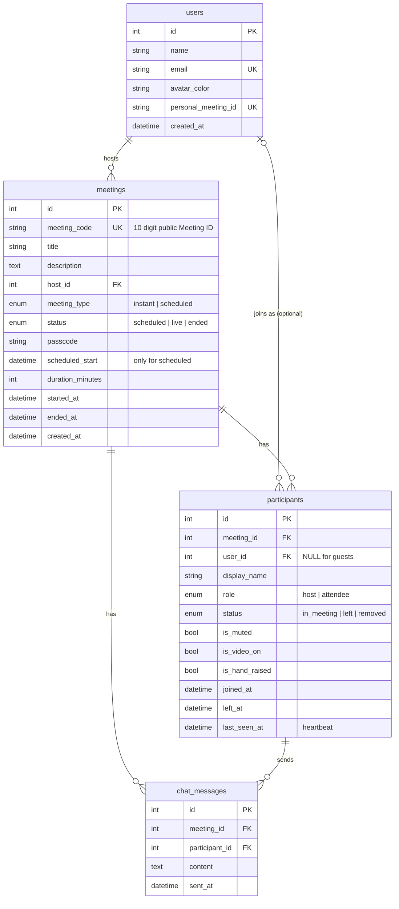

# Zoom Clone: Video Conferencing Web App

A Zoom Workplace style web app where you can start instant meetings, join with a Meeting ID or invite link, schedule meetings, and run a meeting room with participants, chat and host controls.

- **Live app:** _add your Vercel link here_
- **API docs (Swagger):** _add your Railway link here_ + `/docs`

## Tech stack

| Part | Choice | Why |
|---|---|---|
| Frontend | Next.js 14 (App Router), TypeScript, Tailwind CSS | Single page app, fast to style like Zoom |
| Icons | lucide-react | Clean line icons close to Zoom's |
| Backend | Python, FastAPI | Simple, fast, automatic API docs at `/docs` |
| Database | SQLite with SQLAlchemy 2.0 | Required by the brief; ORM keeps queries readable |
| Tests | pytest + FastAPI TestClient | Covers every core flow on the API |
| Hosting | Vercel (frontend), Railway (backend + volume for SQLite) | Vercel is built for Next.js; Railway keeps the SQLite file on a persistent disk |

## Features

**Core**
- **Dashboard:** Zoom style top navbar (Home, Team Chat, Meetings, Calendar, Docs, Apps, search, settings, profile menu), the four big action tiles (New meeting, Join, Schedule, Share screen), a live clock card, **Upcoming meetings** and **Recent meetings**.
- **Instant meeting:** one click creates a meeting with a unique 10 digit Meeting ID, a passcode and a shareable invite link, then drops you into the room as host. The arrow on the tile lets you choose to start with video off.
- **Join meeting:** by Meeting ID (with or without spaces) or by pasting the full invite link. The meeting is checked before you continue. You enter a display name, can preview your camera and mic, and give the passcode (filled in automatically from invite links).
- **Schedule meeting:** topic, description, date picker, time picker (30 minute steps like Zoom), duration, optional custom passcode. The link is generated automatically, saved in the database and shown in Upcoming. After saving you get the full invitation to copy.
- **Meetings page:** Zoom's Meetings tab with Upcoming and Previous lists grouped by day, and a details panel with Start, Copy invitation, Edit and Delete.

**Meeting room**
- Gallery view (tiles sized to fit the screen at 16:9, like Zoom) and Speaker view.
- Your real camera and microphone through the browser, with a green border while you talk.
- Mute / Unmute, Start / Stop Video, Share Screen (your own screen preview), Reactions and Raise Hand.
- Participants panel with search, host and "me" labels, mic and video status.
- Meeting chat to everyone, with an unread badge.
- Meeting info popup (green shield): Meeting ID, host, passcode, invite link.
- Live meeting timer.

**Bonus**
- **Host controls:** Mute All, mute one person, remove a participant, End meeting for all. The server checks the caller is really the host.
- **Responsive:** works on phone, tablet and desktop (side panels become full screen on phones).

## How it works

```
Browser (Next.js on Vercel)  ──HTTPS/JSON──>  FastAPI (Railway)  ──SQLAlchemy──>  SQLite file on a volume
```

**Room updates use polling.** Every 2 seconds the room calls `GET /api/meetings/{code}/state`. One call returns the meeting, the participant list, new chat messages and your own status. The same call is also a heartbeat: anyone who stops calling for 30 seconds (closed tab, lost network) is marked as left. When the last person leaves, the meeting moves to "ended" and shows up in Recent.

**Mute sync.** Your mic and camera are controlled in the browser and pushed to the server. When the host mutes you, the next poll sees `is_muted = true` and the browser turns your mic off and shows "The host has muted you". Your own changes win for a few seconds, so an old poll result can't undo a click.

## Database schema



Design choices:
- **`meeting_code` vs `id`.** `id` is the internal key used in joins. `meeting_code` is the public 10 digit number people type. It is unique and indexed. Keeping them separate means the public ID can follow its own format without touching the keys.
- **`participants.user_id` can be NULL.** Guests join with only a display name, exactly like Zoom. The display name is stored on the participant row because the same user can use a different name in each meeting.
- **One participant row per join.** This keeps a history of who was in each meeting, which is how "Recent meetings" and the meeting duration work.
- **`status` columns instead of deleting rows.** Leaving or being removed keeps the row, so history and chat authors stay intact.
- **Chat links to the participant, not the user.** Guests can chat too, and the message shows the name used in that meeting.
- **Indexes** on `meetings(host_id, status, scheduled_start)` and `meetings(started_at)` for the dashboard queries, `participants(meeting_id, status)` for the live room, and `chat_messages(meeting_id, id)` for fetching new messages.
- **Foreign keys are enforced** (`PRAGMA foreign_keys=ON`) with `ON DELETE CASCADE`, so deleting a meeting removes its participants and messages.
- All times are stored in **UTC** and sent with a timezone, so the browser shows them in local time.

## API

Interactive docs are at `/docs` on the backend.

| Method | Path | What it does |
|---|---|---|
| GET | `/api/users/me` | The default signed in user |
| GET | `/api/meetings/upcoming` | Scheduled meetings that haven't finished |
| GET | `/api/meetings/recent` | Meetings that have started, newest first |
| POST | `/api/meetings/instant` | Create an instant meeting |
| POST | `/api/meetings/scheduled` | Schedule a meeting |
| GET | `/api/meetings/lookup?q=` | Check a Meeting ID or invite link exists (no passcode returned) |
| GET / PATCH / DELETE | `/api/meetings/{code}` | Host only: view, edit, delete |
| POST | `/api/meetings/{code}/join` | Join with display name (+ passcode for guests) |
| GET | `/api/meetings/{code}/state?participant_id=&after_message_id=` | Room polling + heartbeat |
| POST | `/api/meetings/{code}/messages` | Send a chat message |
| POST | `/api/meetings/{code}/mute-all` | Host: mute everyone else |
| POST | `/api/meetings/{code}/end` | Host: end for everyone |
| PATCH | `/api/participants/{id}` | Update your own mic, camera, raised hand |
| POST | `/api/participants/{id}/leave` | Leave the meeting |
| POST | `/api/participants/{id}/mute` | Host: mute one person |
| POST | `/api/participants/{id}/remove` | Host: remove one person |

## Project structure

```
backend/
  app/
    main.py            app setup, CORS, error handling, startup (create tables + seed)
    config.py          settings from environment variables
    database.py        engine, session, foreign keys on
    models.py          SQLAlchemy tables
    schemas.py         Pydantic request/response shapes
    dependencies.py    get_current_user (the default user)
    seed.py            sample users and meetings
    routers/           thin HTTP layer: users, meetings, participants
    services/          business rules: meetings, participants, codes, errors
  tests/test_api.py
frontend/
  app/                 pages: / (home), /meetings, /join, /j/[code] (pre-join), /meeting/[code] (room)
  components/          ui/, layout/, home/, modals/, meetings/, room/
  hooks/               useMeetings, useStartMeeting, useMeetingRoom, useLocalMedia, useGalleryLayout, ...
  lib/                 api.ts (all backend calls), types.ts, format.ts, session.ts
```

Routers only deal with HTTP. All rules (who can join, passcode checks, host checks, when a meeting ends) live in `services/`, which raise plain Python errors that `main.py` turns into HTTP responses.

## Run it locally

You need Python 3.11+ and Node 18+.

**Backend**
```bash
cd backend
python -m venv .venv
source .venv/bin/activate        # Windows: .venv\Scripts\activate
pip install -r requirements-dev.txt
uvicorn app.main:app --reload --port 8000
# tests
pytest -q
```
The SQLite file `zoom.db` is created and seeded on first start. Delete it to reset the data.

**Frontend**
```bash
cd frontend
npm install
cp .env.example .env.local       # NEXT_PUBLIC_API_URL=http://localhost:8000
npm run dev
```
Open http://localhost:3000. To try two people in one meeting, open the invite link in a second browser window (a private window works well).

## Deployment

**Backend on Railway**
1. New Project, then Deploy from GitHub repo, then pick this repo.
2. In the service **Settings**, set **Root Directory** to `backend`. Railway reads `backend/railway.json` for the start command and health check.
3. Add a **Volume** to the service, mounted at `/data`.
4. Under **Variables**, add:
   - `DATABASE_URL` = `sqlite:////data/zoom.db`
   - `FRONTEND_URL` = your Vercel URL, for example `https://your-app.vercel.app`
   - `CORS_ORIGINS` = the same Vercel URL
5. Under **Settings > Networking**, click **Generate Domain**. Check `https://<domain>/api/health` returns `{"status":"ok"}`.

**Frontend on Vercel**
1. Add New Project, then import this repo.
2. Set **Root Directory** to `frontend`. The framework (Next.js) is detected automatically.
3. Add the environment variable `NEXT_PUBLIC_API_URL` = your Railway URL (no trailing slash).
4. Deploy. If you change `NEXT_PUBLIC_API_URL` later, redeploy, because the value is built into the app.

## Assumptions and limits

- **No login.** A default user ("Alex Johnson") is always signed in, as the brief allows. `get_current_user` in `dependencies.py` is the one place to change when adding real authentication.
- **Who is host:** whoever starts the meeting from the dashboard joins with the default user's id and becomes host. People who join from the Join button or an invite link join as guests. Everyone shares the default account, so "host" means "started it from the dashboard".
- **Video between people is not streamed.** Each person sees their own real camera. Other people appear as name tiles with live mic, camera and hand status. Real peer to peer video would need WebRTC plus a signalling server; the room is built so this could be added later without changing the database.
- **Screen sharing and reactions are local.** You see your own shared screen and reactions; others don't. Raised hands are shared through the server.
- **Polling, not WebSockets.** A 2 second poll is simple, reliable on any host and good enough for this size. WebSockets would be the next step for scale.
- **Host controls are checked on the server,** but without login the host is identified by participant id. Real auth would replace this with a token.
- **Personal Meeting ID** is shown in the profile menu but not used to start meetings.
- **Placeholders:** Team Chat, Calendar, Docs, Apps, Search, Settings, Notifications and Sign out show a "not part of this demo" message.
- Times use the browser's time zone.
- The Zoom wordmark is drawn as styled text, not the official logo file.

## What I would add next

- WebRTC video and audio between participants (with a TURN server)
- WebSockets for instant updates
- Real authentication (JWT) and multiple accounts
- Waiting room, recurring meetings, calendar invites (.ics)
- Database migrations with Alembic
